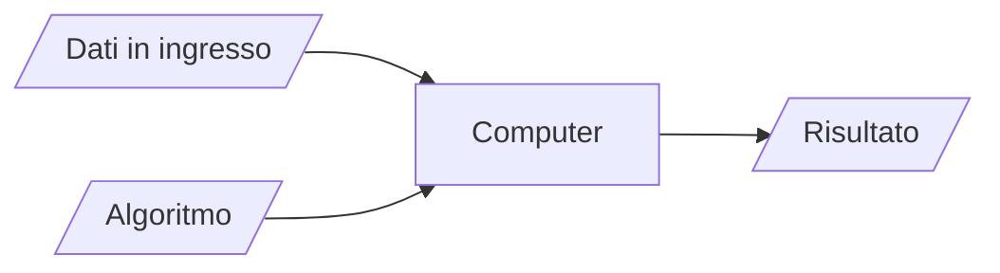
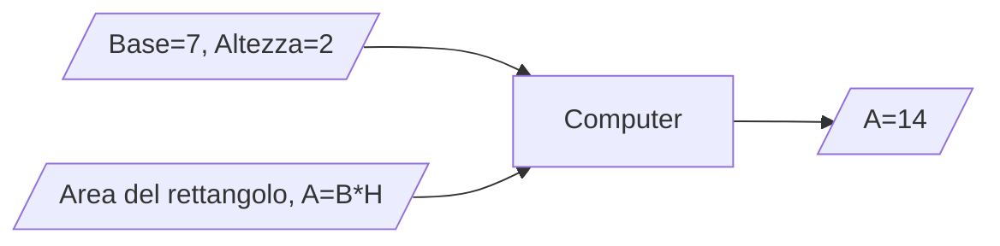

# 1 - Fondamenti di Informatica

Ing. Giancarlo Degani

---
level: 3

---

# Il corso

- **Programma:**
  - Prima parte: cultura informatica
  - Seconda parte: programmazione in linguaggio 'C'
- **Durata:** 30 ore
- **Verifica:** test finale con domande a risposta multipla

---
level: 3
---

# Strumenti

- Dispense delle lezioni
- Classroom
- CLion

---
layout: image-right

image: /clion1.png

level: 3
---

# CLion

- [CLion Download](https://www.jetbrains.com/clion/)
- [Educational license](https://www.jetbrains.com/community/education/#students/)

---
layout: image-right
image: /clion_license.png
level: 3

---

# Licenza per STUDENTI

- Creare un account con l’email **@itsmeccatronico.it** e richiedere una licenza educational
- Scaricare ed installare CLion
- Aprire il programma e registrare la licenza inserendo le credenziali dell’account in **Help > Register**

---
level: 3
---

# Riferimenti

- <https://cplusplus.com/reference/clibrary/>
- <https://en.wikibooks.org/wiki/C_Programming>
- <https://archive.org/details/Apress.Beginning.C.5th.Edition.2013>

---
hide: true
layout: quote

level: 3

---

# quote

 
 
 
“Algoritmi + Strutture Dati = Programmi”

*Niklaus Wirth*

---
level: 3
---

# ALGORITMO

- Il termine deriva dalla trascrizione latina del nome del matematico persiano al-Khwarizmi, vissuto nel IX secolo d.C. È considerato uno dei primi autori ad aver fatto riferimento a questo concetto, scrivendo il libro “Regole di ripristino e riduzione”.
- In matematica e informatica, un algoritmo è la specificazione di una sequenza finita di operazioni (dette anche istruzioni) che consente di risolvere una classe di problemi specifici o di calcolare il risultato di un'espressione matematica.

---
level: 3
---

# Proprietà di un algoritmo

- **Finito:** costituito da un numero finito di istruzioni.
- **Deterministico:** partendo dagli stessi dati di ingresso, ottengo gli stessi risultati.
- **Generale:** applicabile a tutti i problemi della classe a cui si riferisce.  
  - Ad esempio, l’algoritmo per il calcolo dell’area di un rettangolo deve essere applicabile a tutti i rettangoli.
- **Eseguibile:** esiste un esecutore in grado di eseguire tutte le istruzioni in un tempo finito.

---
layout: image-right
image: /human_computer.png
level: 3

---

# Caratteristiche degli Esecutori

- Il linguaggio che possono comprendere (italiano, inglese, C, TypeScript, ecc.)
- Le azioni che possono eseguire
- Le regole che associano alle istruzioni fornite le azioni da eseguire 

---
level: 3
---

# Calcolatore COME ESECUTORE

 
 
 

---
level: 3
---

# ESEMPIO

 
 
 

---
level: 3
---

# STRUTTURE DATI

- I contenitori usati per contenere i dati in ingresso sono detti variabili.
- Le variabili:
  - Hanno un nome o identificatore.
  - Possono essere usate come parte di una istruzione.
  - Possono essere caratterizzate dal tipo di dato che contengono (es. variabili per numeri interi, numeri reali, sequenze di numeri, ecc.)

---
level: 3
---

# ISTRUZIONI DI ASSEGNAZIONE

- Consentono di inserire un valore all’interno di una variabile.
- Cambiano a seconda del linguaggio utilizzato, ma solitamente usano l’operatore “=”.
  - x=5 assegna il valore 5 alla variabile x.
  - y=x assegna il valore contenuto nella variabile x alla variabile y.

---
level: 3
---

# ESPRESSIONI ARITMETICHE

Sono costituite da:

- Operandi: variabili, costanti, espressioni aritmetiche
- Operatori: addizione ‘+’, sottrazione ‘-‘, moltiplicazione ‘*’, divisione intera ‘/‘, resto o modulo ‘%’
- Parentesi: per definire l’ordine con cui vengono elaborate
- Risultato: un numero

---
level: 3
---
# ESEMPI

|||
|:---|:---|
| X = 5 |Assegna alla variabile x il valore 5|
|X = 5+3|Assegna ad x il valore 8|
|Y = 5%3|Assegna ad y il valore 2|
|X = X *3|Assegna ad x il valore precedente moltiplicato per 3|

---
level: 3
---

# ESPRESSIONI RELAZIONALI

Sono costituite da:
- Operandi: variabili, costanti, espressioni.
- Operatori: uguaglianza ==, disuguaglianza !=, maggiore di >, minore di <.
- Parentesi: per definire l’ordine con cui vengono elaborate.
- Risultato: vero o falso.

---
level: 3
---
# ESEMPI

|||
|:---|:---|
|X = 5|Assegna alla variabile x il valore 5|
|X == 5|Vero|
|X != 5|Falso|
|X > 0|Vero|

---
level: 3
---
# ESPRESSIONI LOGICHE

Sono costituite da:

- Operandi: variabili, costanti, espressioni
- Operatori: somma logica (OR), moltiplicazione logica (AND), negazione (NOT)
- Parentesi: per definire l’ordine con cui vengono elaborate
- Risultato: un valore logico, vero o falso
