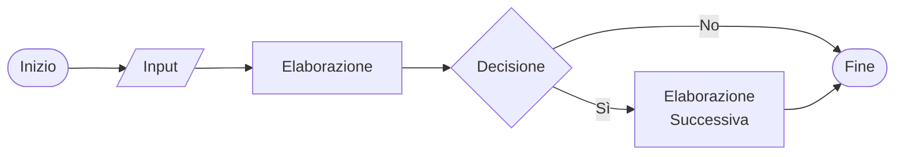
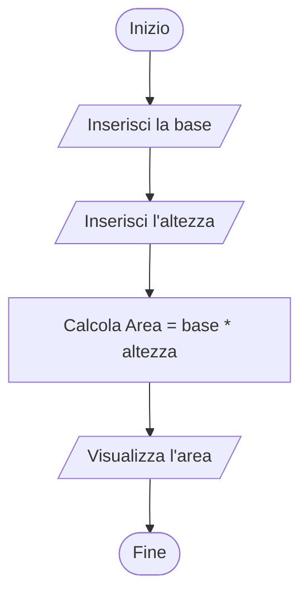
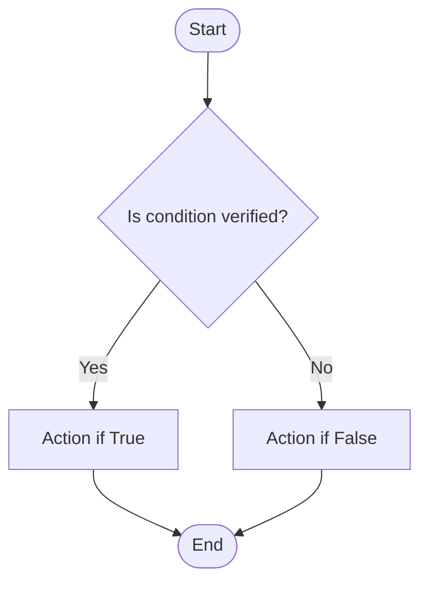
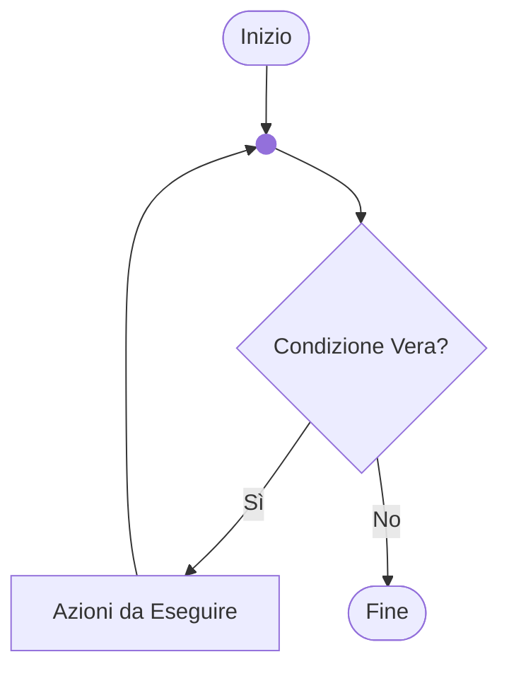
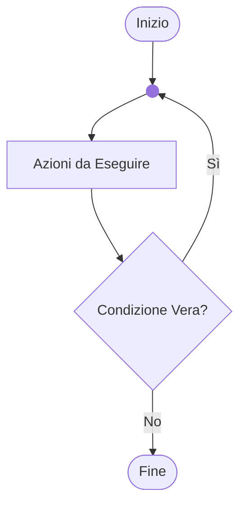
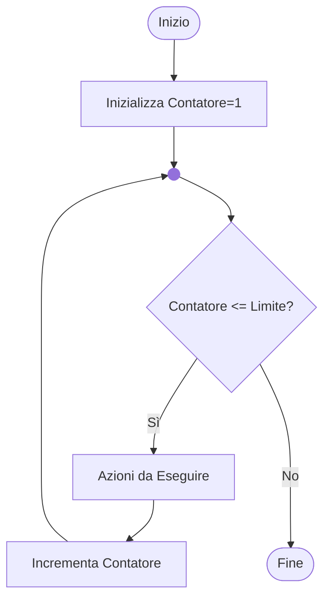
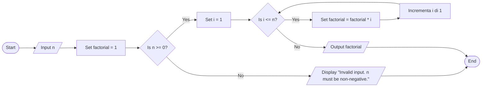
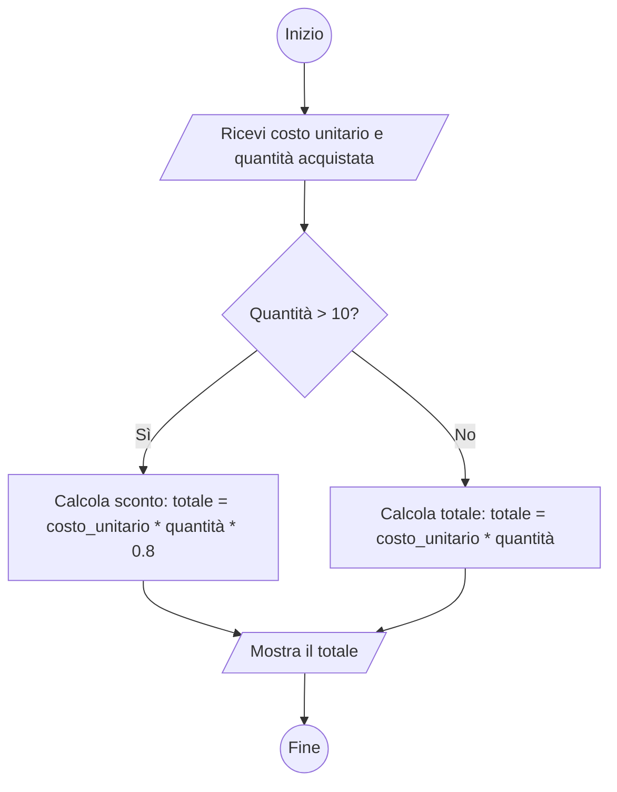
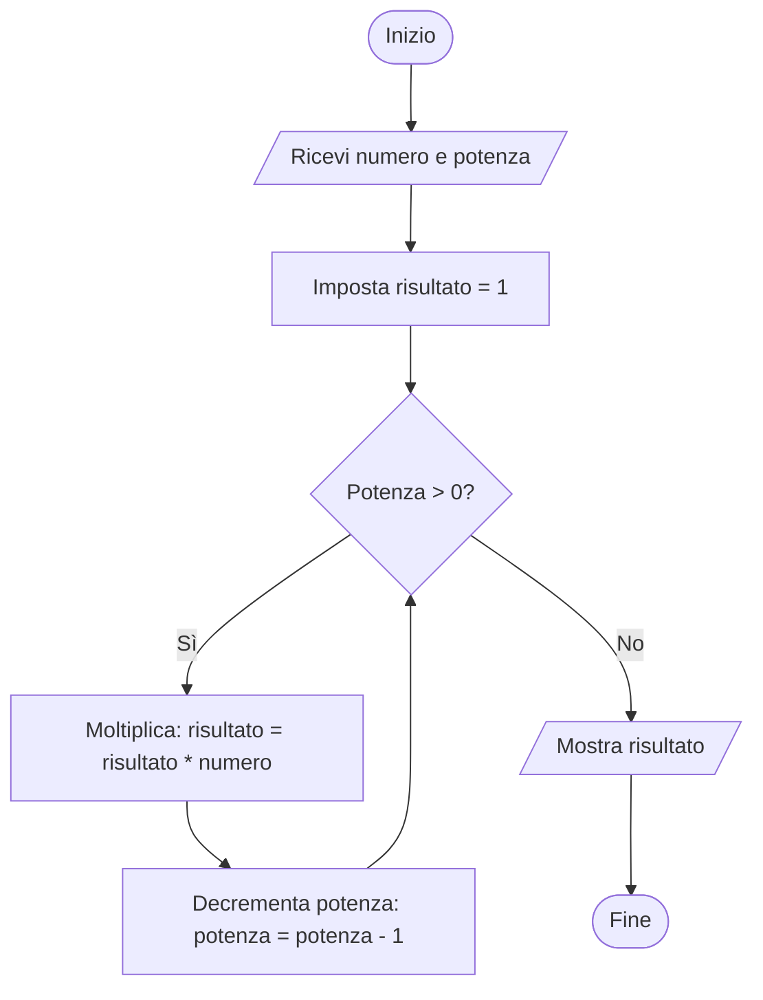

# Operatori logici

::left::

## Negazione

|A|**NOT** A|
|---|---|
|0|1|
|1|0|

::right::

## Moltiplicazione

|A|B|A **AND** B|
|---|---|---|
|0|0|0|
|0|1|0|
|1|0|0|
|1|1|1|

---
layout: two-cols-header
level: 3

---

# Operatori logici

::left::

## Somma

|A|B|A **OR** B|
|---|---|---|
|0|0|0|
|0|1|1|
|1|0|1|
|1|1|1|

::right::

## Disuguaglianza

|A|B|A **XOR** B|
|---|---|---|
|0|0|0|
|0|1|1|
|1|0|1|
|1|1|0|

---
level: 3
---

# DIAGRAMMA DI FLUSSO/FLOW CHART

- Consentono di rappresentare visivamente un algoritmo.
- Sono indipendenti dal linguaggio di programmazione.
- Esistono diversi standard grafici.

---
layout: image
image: /flowchart.png
backgroundSize: contain
title: Simboli flowchart
level: 3
---

---
level: 3
---

# Esempio di flowchart

---
layout: two-cols
level: 3
---

# Esempio: area di un rettangolo

- Calcolo dell’area di un rettangolo
- Input: base ed altezza
- Algoritmo: Area = base * altezza

::right::

---
layout: two-cols
level: 3
---

# Selezione - IF THEN ELSE

- Viene valutata una condizione.
- Se la condizione è vera, l’elaborazione prosegue con il ramo di sinistra.
- Se la condizione è falsa, l’elaborazione prosegue con il ramo di destra.

::right::

---
layout: two-cols
level: 3
---

# Ciclo While

- Viene valutata una condizione.
- Se la condizione è vera, viene eseguita l’azione e poi viene rivalutata la condizione.
- Si esce dal ciclo quando la condizione diventa falsa.

::right::

---
layout: two-cols
level: 3
---

# Ciclo do while

- Viene eseguita l’azione.
- Se la condizione è vera, l’azione viene eseguita nuovamente e poi viene rivalutata la condizione.
- Si esce dal ciclo quando la condizione diventa falsa.
- Nel ciclo do-while l’azione viene eseguita almeno una volta.

::right::

---
layout: two-cols
level: 3
---

# Ciclo for

- Viene valutata la condizione e, se vera, si esegue l’azione.
- L’azione viene eseguita un numero finito di volte.

::right::

---
layout: two-cols
level: 3
---

# Esempio: CALCOLO DEL FATTORIALE

Dato un numero intero, calcolarne il fattoriale.

- Input: un numero intero maggiore o uguale a zero
- Algoritmo: moltiplico n per tutti i numeri minori di n, fino a 2

::right::

 
 
 
 
 
 
 
$$
n! = 
\begin{cases} 
1 & \text{se } n = 0 \\
n \times (n-1) \times \cdots \times 2 \times 1 & \text{se } n > 0
\end{cases}
$$

---
level: 3
---

# Esempio: CALCOLO DEL FATTORIALE

---
level: 3
---

# ESERCIZIO

Rappresentare un algoritmo per il calcolo del costo di un prodotto che soddisfi i seguenti requisiti:
- Input: costo unitario, quantità acquistata
- Se il numero di elementi acquistati è superiore a 10, applicare uno sconto del 20%
- Output: costo totale

---
layout: two-cols
level: 3
---

# flow-chart

Flowchart della soluzione

::right::

---
level: 3
---

# ESERCIZIO

Rappresentare un algoritmo per il calcolo della potenza n-esima di un numero intero che soddisfi i seguenti requisiti:
- Input: numero, potenza
- Output: numero^potenza
- Usare solo le operazioni elementari: +, -, *, /

---
layout: two-cols
level: 3

--- 

# flow-chart

Flowchart della soluzione

::right::

---
level: 3
---

# Codifiche numeriche

|Sistema|Base|Simboli|
|---|---|---|
|Binario|2|\{0,1\}|
|Ottale|8|\{0,1,2,3,4,5,6,7\}|
|Decimale|10|\{0,1,2,3,4,5,6,7,8,9\}|
|Esadecimale|16|\{0,1,2,3,4,5,6,7,8,9,A,B,C,D,E,F\}|

---
level: 3
---

# Esempi

|Decimale|Binario|Esadecimale|
|---|---|---|
|2|10|2|
|10|1010|A|
|16|1 0000|10|
|255|1111 1111|FF|

---
level: 3

---

# Codifica numerica posizionale

 

$$
n = \sum_{\substack{0 < i < m}} r_j \cdot b^j
$$

$$
1024 = 1 \times 10^3 + 0 \times 10^2 + 2 \times 10^1 + 4 \times 10^0 = 1024_{10}
$$

 

$$
10 = 1 \times 2^3 + 0 \times 2^2 + 1 \times 2^1 + 0 \times 2^0 = 1010_2
$$

 

$$
1024_{10} = 1 \times 2^{10} + 0 \times 2^9 + 0 \times 2^8 + 0 \times 2^7 + 0 \times 2^6 + 0 \times 2^5 
\\+ 0 \times 2^4 + 0 \times 2^3 + 0 \times 2^2 + 0 \times 2^1 + 0 \times 2^0 = 100 0000 0000_2
$$

---
layout: two-cols
---

# Conversione IN BINARIO

- Per convertire un numero da base decimale a base binaria si utilizzano le operazioni di divisione intera e modulo (quoziente e resto):
  - Divido il numero per 2 e salvo il resto della divisione.
  - Ripeto fino a che il quoziente diventa zero.

$$
\begin{align*}
1972_{10} = 111;1011;0111_2
\end{align*}
$$

::right::

|N div B|N mod B||
|---|---|---|
|1972 / 2|986|0 ← LSB|
| 986 / 2  | 493    | 0       |
| 493 / 2  | 246    | 1       |
|…|…|…|
| 15 / 2   | 7      | 1       |
| 7 / 2    | 3      | 1       |
| 3 / 2    | 1      | 1       |
| 1 / 2    | 0      | 1 ← MSB |
