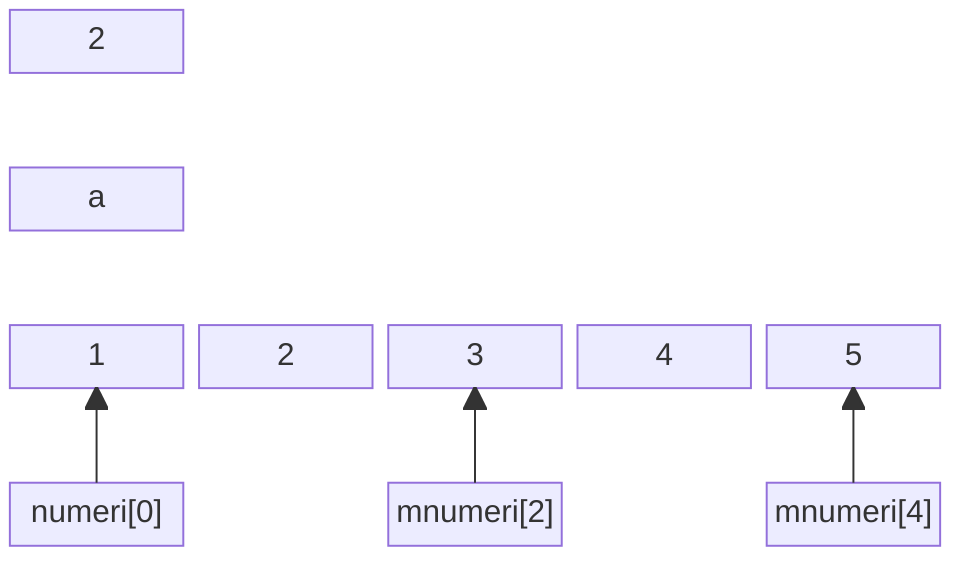
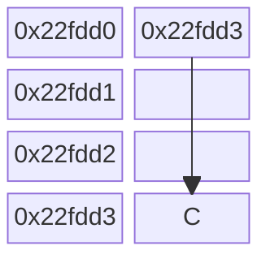
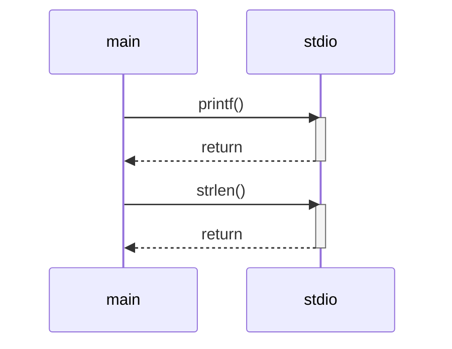

---
# test1
---
# test

```mermaid {scale: 0.9, alt: 'A diagram'}
block-beta
    columns 5
    2 space:4
    space:5
    a space:4
    space:5
    n1["1"] n2["2"] n3["3"] n4["4"] n5["5"]
    space:5
    l0["numeri[0]"] space l1["mnumeri[2]"] space l2["mnumeri[4]"]

    l0 --> n1
    l1 --> n3
    l2 --> n5

```

---

```mermaid {scale: 0.9, alt: 'A diagram'}
block-beta
    columns 2
    c11["0x22fdd0"] c12["0x22fdd3"]
    c21["0x22fdd1"] c22[" "]
    c31["0x22fdd2"] c32[" "]
    c41["0x22fdd3"] c42["C"]

c12 --> c42

```

---

```mermaid {scale: 0.9, alt: 'A diagram'}

sequenceDiagram
    main ->> stdio:printf()
    activate stdio
    stdio -->> main: return
    deactivate stdio
    main ->> stdio:strlen()
    activate stdio
    
    stdio -->> main: return
   deactivate stdio
    
```
