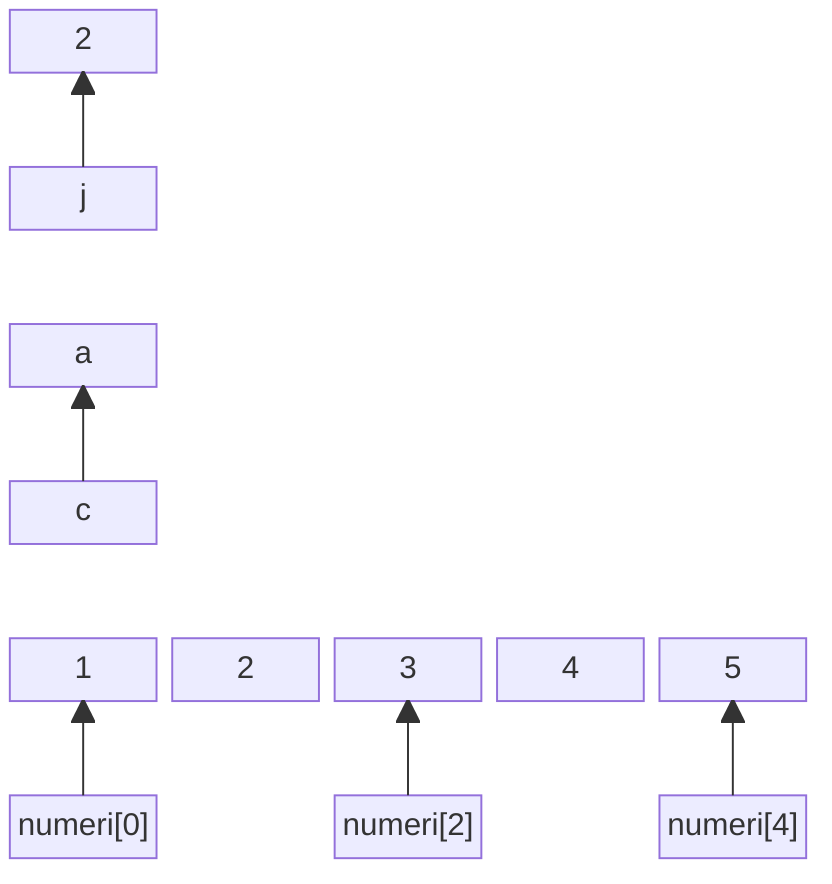
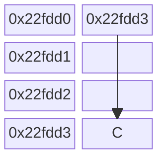
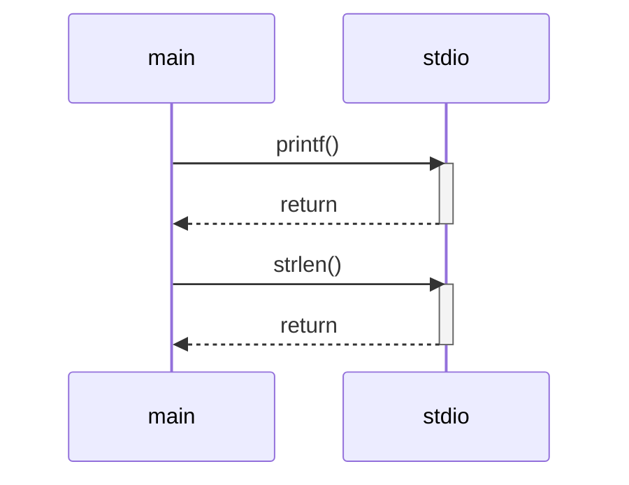

# 4 - Vettori e matrici

Ing. Giancarlo Degani

---

# Soluzione es. carrello

<<< @/examples/example04/main.c c {*}{lines:true,maxHeight:'400px'}

---
title: output carrello

---

```
Inserisci il numero di oggetti nel carrello: 12
Inserisci il prezzo unitario degli oggetti: 1000

===== Dettaglio del Carrello =====
Numero di oggetti: 12
Prezzo unitario: 1000.00
Totale prima dello sconto: 12000.00
Sconto applicato: 1200.00
Imponibile (dopo sconto): 10800.00
IVA (22%): 2376.00
Totale lordo: 13176.00
==============================

```
---

# Soluzione es. radice

<<< @/examples/example05/main.c c {*}{lines:true,maxHeight:'400px'}

---
title: output radice
---
```
Inserisci un numero maggiore di 1: 5
Punto medio: 3.0000000
Punto medio: 2.0000000
Punto medio: 2.5000000
Punto medio: 2.2500000
Punto medio: 2.1250000
Punto medio: 2.1875000
Punto medio: 2.2187500
Punto medio: 2.2360535
Punto medio: 2.2360687
Punto medio: 2.2360611
Punto medio: 2.2360649
Punto medio: 2.2360668
Punto medio: 2.2360678
Punto medio: 2.2360682
Punto medio: 2.2360680
Punto medio: 2.2360679
Punto medio: 2.2360680
La radice quadrata approssimata di 5.0 è: 2.2360680
```

---

# Vettori 

- Variabile Scalare: contiene 1 singolo valore:  

```c
tipo identificatore = valore;
```

- Variabili vettoriali: contengono più valori dello stesso tipo: 

```c
tipo identificatore [ dimensione ] = valore ; 
```

- **dimensione** deve essere una costante intera, positiva, e nota al momento della compilazione
- Contengono elementi dello stesso tipo scalare ( int, double, char,… )
- L'indici e di tipo intero e non negativo
- Il primo elemento ha indice 0 (posizione) 
- L’ultimo elemento ha indice N-1 ( N è la dimensione del vettore ) 

---
layout: two-cols

---

# Esempi

- Valori scalari

```c
int j = 2
char c = ‘a’
```

- vettore di 5 elementi

```c
int numeri[5]= {1,2,3,4,5}
```

::right::



---

# Vettori

- Gli elementi del vettore sono allocati in locazioni di memoria 
contigue e successive
- Si accede ai singoli elementi indicando il nome del vettore seguito dall'indice fra parentesi quadre

---

# Vettori

- Poiché ciascun elemento del vettore è del tipo indicato nella definizione, può essere utilizzato in tutti i contesti in cui si può usare una variabile di quel tipo

```c
int vett[10];
scanf("%d", &vett[4]);
x = vett[4] * 5;

```

---
layout: two-cols

---

# Vettori

- I vettori possono essere attraversati agevolmente mediante un ciclo **for**
- Il nome di un vettore è usato dal compilatore come sinonimo dell’indirizzo di memoria del primo elemento del vettore
- Si “sfora” il vettore quando si accede a elementi oltre i limiti del vettore

::right::
<br>
<br>

```c
#define N 10
int vett[N];
for (i=0; i<N; i++){
  scanf("%d", &vett[i]);
}
for (i=N-1; i>=0; i--){
  printf("%d\n", vett[i]);
}

```

---

# Esercizi

- Scrivere un programma che chieda quanti valori verranno introdotti dalla tastiera (max 100), li chieda tutti e successivamente visualizzi prima tutti i valori pari nell’ordine in cui sono stati inseriti e poi tutti i valori dispari nell’ordine inverso.
- Scrivere un programma che, dati in input N numeri reali, con N che al massimo vale 100, stampi quanti di essi sono maggiori della media e successivamente li stampi a video


---

# Matrici

- Definizione

```c
tipo identificatore [ numero_righe ] [ numero_colonne ] ;
```

- Es: matrice con 10 righe e 20 colonne:

```c
int matrice [ 10 ] [ 20 ];
```

- Gli indici di riga e colonna vanno da 0 a N-1, dove N è la dimensione

---



---


