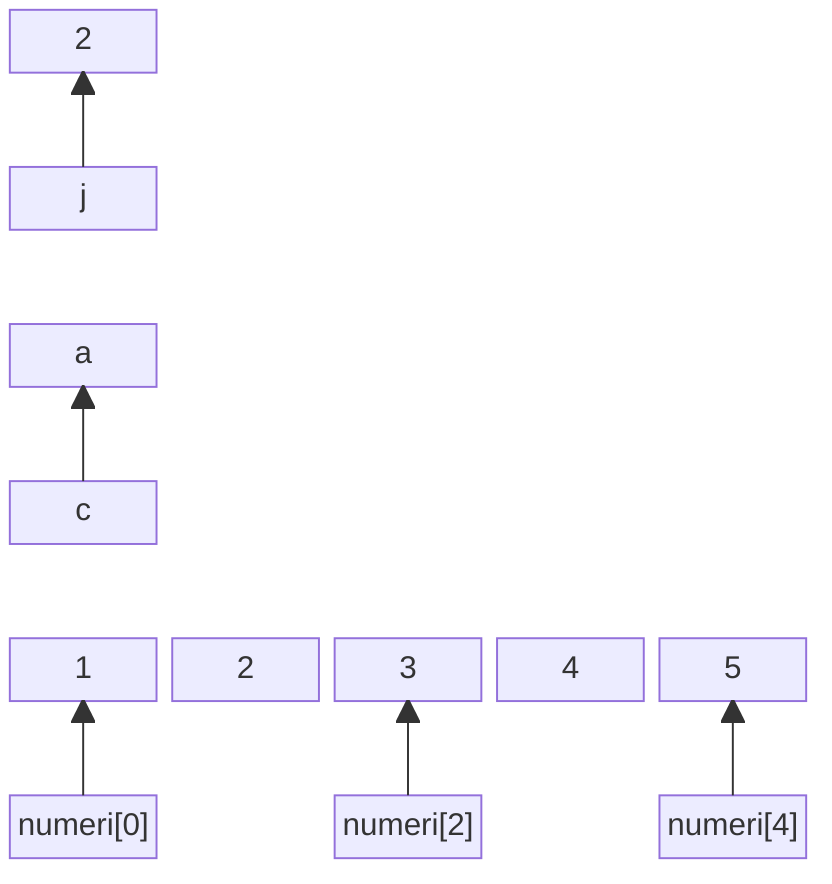
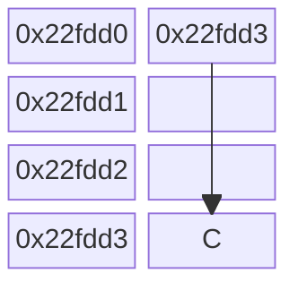
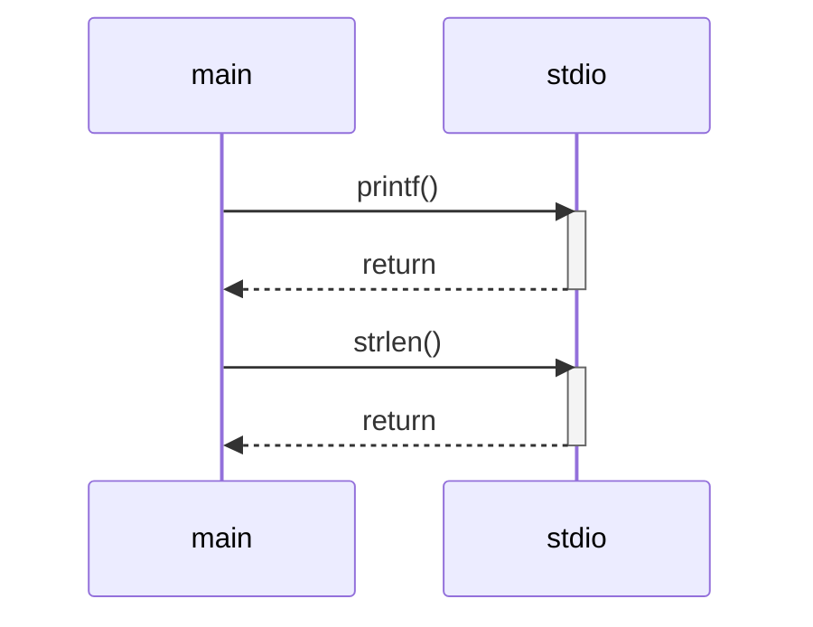

# 4 - Vettori e matrici

Ing. Giancarlo Degani

---
level: 3

---

# Vettori

- Variabile Scalare: contiene 1 singolo valore:  

```c
tipo identificatore = valore;
```

- Variabili vettoriali: contengono più valori dello stesso tipo: 

```c
tipo identificatore [ dimensione ] = valore ; 
```

- Contengono elementi dello stesso tipo scalare ( int, double, char,… )
- Il primo elemento ha indice 0 (posizione) 
- L’ultimo elemento ha indice N-1 ( N è la dimensione del vettore ) 

---
layout: two-cols
---

# vettori

```c
int j = 2
char c = ‘a’
int numeri[5]= {1,2,3,4,5}
```

::right::



---

# Vettori

- Gli elementi del vettore sono allocati in locazioni di memoria contigue e successive
- Il nome di un vettore è usato dal compilatore come sinonimo dell’indirizzo di memoria del primo elemento del vettore
- Si “sfora” il vettore quando si accede a elementi oltre i limiti del vettore
- Poiché ciascun elemento del vettore è del tipo indicato nella definizione, può essere utilizzato in tutti i contesti in cui si può usare una variabile di quel tipo

---

# Matrici

- Definizione

```c
tipo identificatore [ numero_righe ] [ numero_colonne ] ;
```

- Es: matrice con 10 righe e 20 colonne:

```c
int matrice [ 10 ] [ 20 ];
```

- Gli indici di riga e colonna vanno da 0 a N-1, dove N è la dimensione

---



---


